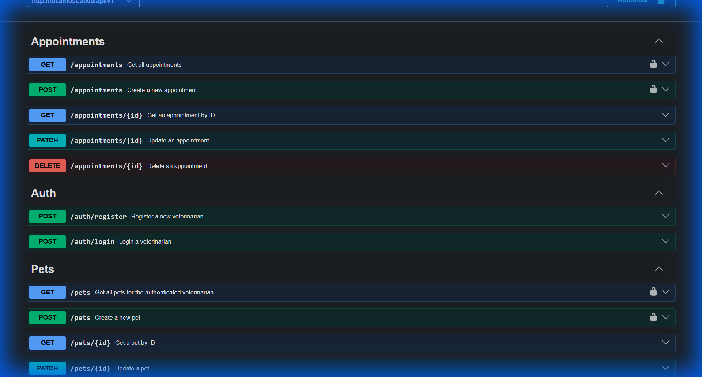

# Vet API 🐾

Una API REST robusta para la gestión de clínicas veterinarias, construida con **Node.js**, **TypeScript**, **Prisma** y **PostgreSQL**.



## 🚀 Características

- **Autenticación Segura**: Implementación de JWT para el registro y acceso de veterinarios.
- **Gestión de Mascotas**: CRUD completo para el seguimiento de pacientes animales.
- **Sistema de Citas**: Gestión dinámica de citas veterinarias.
- **Arquitectura MVC**: Estructura de código limpia y escalable.
- **Documentación Interactiva**: Documentado con Swagger UI.
- **Base de Datos**: PostgreSQL con Prisma ORM.
- **Despliegue Continuo**: Configurado para Render con `render.yaml`.

## 🛠️ Tecnologías

- [Express.js](https://expressjs.com/) - Framework web.
- [TypeScript](https://www.typescriptlang.org/) - Superset de JavaScript.
- [Prisma](https://www.prisma.io/) - ORM para PostgreSQL.
- [Zod](https://zod.dev/) - Validación de esquemas.
- [Swagger](https://swagger.io/) - Documentación de API.
- [Bcrypt](https://www.npmjs.com/package/bcrypt) - Hasheo de contraseñas.

## 🏁 Inicio Rápido

### Requisitos Previos

- Node.js (v18+)
- Docker (opcional, para la base de datos local)
- PostgreSQL

### Instalación

1. Clona el repositorio:
   ```bash
   git clone https://github.com/jujomago/api-vet.git
   cd api-vet
   ```

2. Instala las dependencias:
   ```bash
   npm install
   ```

3. Configura las variables de entorno:
   Copia el archivo `.env.example` a `.env` y ajusta tus credenciales.
   ```bash
   cp .env.example .env
   ```

4. Genera el cliente de Prisma y ejecuta las migraciones:
   ```bash
   npx prisma generate
   npx prisma migrate dev
   ```

5. Inicia el servidor de desarrollo:
   ```bash
   npm run dev
   ```

## 📖 Documentación

Una vez que el servidor esté corriendo, puedes acceder a la documentación interactiva en:
`http://localhost:10000/api-docs`

## ☁️ Despliegue

Este proyecto está configurado para desplegarse automáticamente en **Render** utilizando el archivo `render.yaml`. Incluye la configuración necesaria para la base de datos PostgreSQL gestionada y el servicio web.

---
Desarrollado con ❤️ por [Josue Mancilla (jujomago)](https://github.com/jujomago).
